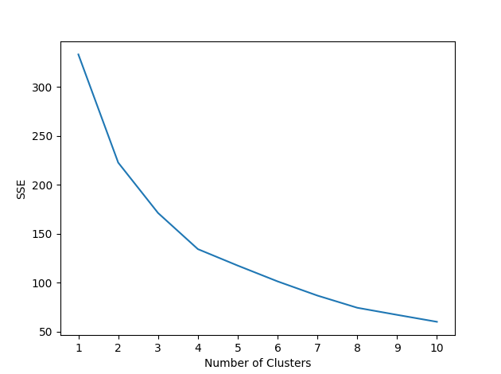
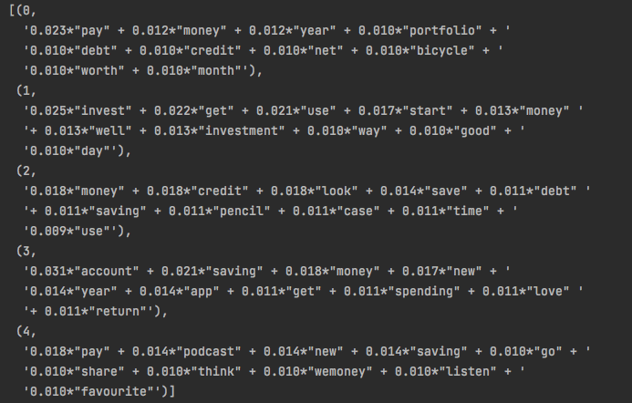
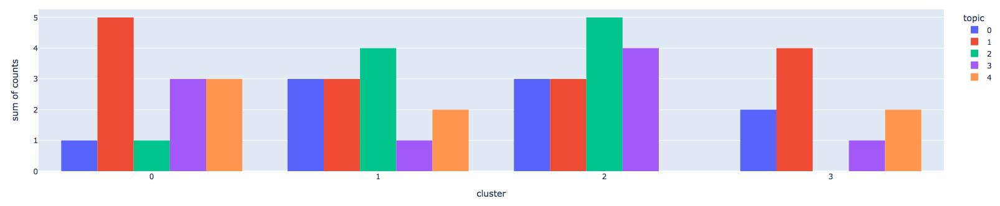

# WeMoney User Personalisation


The problem presented was to take a dataset of 50 users and their interests and 50 historic posts to find a methodology to rank posts specifically for each user.
From this sample of data, there's not really enough data to get any sort of statistical significance so instead, I’ve gone with a method that would work for larger pieces of data and still applied it anyway.

I’ve gone with a method that uses unsupervised learning because the dataset is unknown to me so I can’t apply any sort of expert system to initially group these users for supervised learning methods.
I used a simple K-Means algorithm in `clustering_model.py` to cluster the users into groups which is calculated by their age and their interest categories.
Running some analysis, it appeared that with the dataset I’ve been given, 4 groups could be made without making data too sparse. As you can see below, the elbow point at 4 for the SSE (Sum of Square Error).



Of these 4 groups, I wanted to know what sort of posts they typically create. The thinking behind this is that most social media posts I know of have a tendency to show you more of what you either look at or post. Because I have no data on what these users look at, I will show them what similar users typically post.

For this, I have decided to use LDA in `LDA.py` to break the posts into topics. Analysis shows that 5 topics seems to give a level of comprehension of the topics at an acceptable level. And there seems to be some distinct topic creation out of the 5 as can be seen below:



It must be noted however that with the minimal data, these topics will have some cross-over of keywords. For example, 'save' and 'saving' get used multiple times in topics but with varying levels of importance.

By taking these topics and applying them to each post, we get a score of each post by topic. Taking the highest value yields the topic assigned for that post. I have then aggregated the posts by the cluster group assigned to the user who wrote it. The results are shown below:



Using this information, I have then created ratio scores to show the propensity for a group to post a certain topic in `topic_mapping.py`.

With these two models, I can now decide which group a user belongs to and which topics they typically like to post about.

The last piece I’ve looked at is to add a recency measure for each post.
The methodology used is to take a scalar (1000000 in this case) and divide it by the number of seconds from the passed date value to the post datetime. This is then cubed to stretch the values out.
This is a means to penalise old posts in the ranking system and heavily reward very recent posts.
With a larger dataset, these parameters can be tweaked to get the desired balance of topic relevance and recency.
To do this though, there must be a source of behavioural data that can provide testable answers to hypothesis.

## Algorithm Calculation

The makeup of the final algorithm groups the posts together in their conversations (by parent_id) and calculates metrics to rank.

The first is the mean LDA score ratio explained above. So for a conversation with three posts, the mean of the LDA score ratio is taken. For a single post as a conversation, the mean is simply the ratio value calculated.
This score is meant to provide a relevance measure to the user.
The second is the sum of the LDA ratios. This is a measure to try and show the relevancy of a conversation overall. If there are posts within a conversation of high relevence then adding them together will rank the conversation higher.
To get around the problem of many irrelevant posts summed together, the mean and the sum are multiplied together.
These are then finally multiplied by the recency score to give a final value. This end score is ranked to sort the posts.

This algorithm can be changed as needed. If there is some data available on how users interact with these posts then the algorithm can be optimised for success.

I have then put all of this together in a final function which is called from an API by providing a UID and date value.
The sorted posts data is returned.

## Installation

All of the application dependencies are in the `requirements.txt` file. After
pulling this repository down, you can get started with the following:

```shell
pip install -r requirements.txt
```

Once the required packages are loaded, you must then load from Spacy the used model for LDA.

```shell
python -m spacy download en_core_web_sm
```

I have created this in python 3.9 and recommend this version for consistency.

## Running

There are several scripts that can be run to either explore the creation of the models I have mentioned above or to run the finished API locally.

### Personalisation API

To run the API locally, simply run the script `personalisation_api.py`.
Open a browser and make the API GET call in the format below.

Please note that date format must be in the format 'YYYY-MM-DD' or Datetime 'YYYY-MM-DD HH:MM:SS'
Please also make sure to make the space character in the datetime a '%20'.
I haven't set a default value as current date, so it must be entered for each call.
```http request
http://127.0.0.1:5000/uid/date
```
EXAMPLE:
```http request
http://127.0.0.1:5000/eb2ec654-dbdd-4437-9eda-3b03b1ea13e3/2022-02-10
```

Or alternatively, make an API call with parameters.

```http request
http://127.0.0.1:5000/?uid=xxx&date=xxx
```
EXAMPLE:
```http request
http://127.0.0.1:5000/?uid=eb2ec654-dbdd-4437-9eda-3b03b1ea13e3&date=2022-02-10
```

This will return the fully sorted and ranked list of posts for any given user at a specific Date/Time.

## Unit Testing

To check unit testing, run `personalisation_api.py`

Within this test, functions that make up the full calculation of the sorted list are tested in order of usage.
Most test data outputs against set known outputs that have been saved to csv in `/data/test_cases/`

